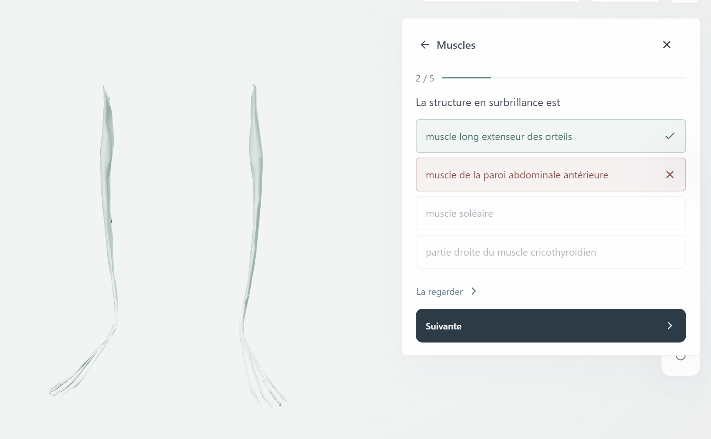
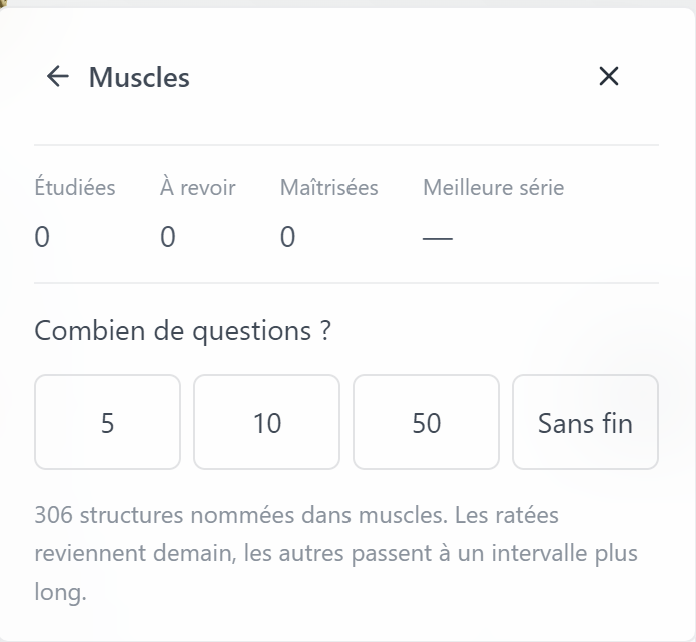

# Atlas

An interactive 3D atlas of the human body, running inside [Mnemosyne OS](https://mnemosyne-os.io) with no network connection at all.

Two bodies, 2,234 individually selectable meshes and 3,432 named anatomical structures. Toggle fifteen systems, isolate a single structure, or explode the whole body into its parts. Then revise what you are looking at, and ask what your own notes already say about it.

## This is a port, and the viewer is not ours

The 3D viewer is **[Human Atlas](https://github.com/ashemag/human-atlas) by Ashe Magalhaes**, released under MIT. The scene, the geometry batching, the exploded layout, the search and the styling are all upstream's work. [`NOTICE.md`](./NOTICE.md) lists every change we made and why, including the two upstream bugs we had to fix to ship it.

The anatomy is two datasets, and their attribution is a licence condition, not a courtesy:

> BodyParts3D, © The Database Center for Life Science licensed under [CC Attribution 4.0 International](https://creativecommons.org/licenses/by/4.0/).

> Kristen Browne; Heidi Schlehlein. 2023. *3D Reference Organ Set for Female, v1.5.* [CC BY 4.0](https://creativecommons.org/licenses/by/4.0/).

Both are shown in the app's *Source & credits* panel, whichever body is on screen, because the cartridge distributes both. Do not remove them.

## What the cartridge adds

**A memory panel.** Every structure carries an **FMA identifier** — `FMA14769` is `hepatic artery` whatever language you work in, however you spell it, whichever source it came from. That makes the body a spatial index into your own memory. Select a structure, press the button, and Mnemosyne answers from your own vaults: the lecture notes you wrote, the figures pulled out of your PDFs, the chronicle from the day you studied it.

It is a button and not an automatic lookup, on purpose. Asking memory a question costs a model call, and browsing a skeleton should not bill anyone.

If your memory holds nothing about that structure, the panel says so in those words. It does not say the feature is broken, and it does not invent an answer.

**Revision.** One level per organ system, derived from the atlas that is actually loaded, so the counts on the tiles are the counts that will be asked. Runs of 5, 10, 50 or endless, with a Leitner schedule filed against the FMA id rather than against a name. A run is written to the cartridge's own vault as a single chronicle, and only when you press save.

A question highlights one structure in the body and offers four names from the same system, so a wrong answer is wrong for an anatomical reason and not because the other options were obviously absurd. *La regarder* moves the camera onto the structure instead of telling you the answer.

The four counters are the level's own state, and a streak nobody has set yet renders as a dash rather than as a zero. The line underneath says how many structures the level can actually ask about in the language you are working in.

**Seven interface languages, and structure names in French and Spanish.** The names come from Wikidata and are **not reviewed by anatomists** — the app says so in a notice you have to dismiss once per language, names English as the reference, and tells you how many structures that language actually covers. A question never mixes two languages: the quiz only asks about structures that have a name in the language you are working in.

## What it does not do

- **It is not a diagnostic or surgical tool.** It is an anatomical reference with simplified, web-optimised geometry.
- **It does not contain every human structure.** The peripheral nervous system is largely absent from these datasets, and the female reference set is an organ set rather than a whole-body model: it has no arms, no hands, no feet, and 16 muscles of which 12 are eye muscles. The app's own credits panel says so.
- **It reads your memory, and it writes only its own.** The cartridge asks for `vault:read` and `vault:write`. The write permission exists for one thing: saving a revision run into the cartridge's own sandbox vault, on your gesture. It never writes to your other vaults — a sandbox vault is a store the cartridge owns, and making anything in it permanent is a decision you make in the shell, not one the cartridge can take.

## Installing

Install it from MnemoHub like any other cartridge. Nothing is built, downloaded or compiled on your machine: the 3D geometry ships with the cartridge and is read straight off your disk.

## Licence

MIT, with the upstream copyright preserved. Anatomy data under CC BY 4.0. Structure names from Wikidata under CC0. See [`LICENSE`](./LICENSE) and [`NOTICE.md`](./NOTICE.md).
