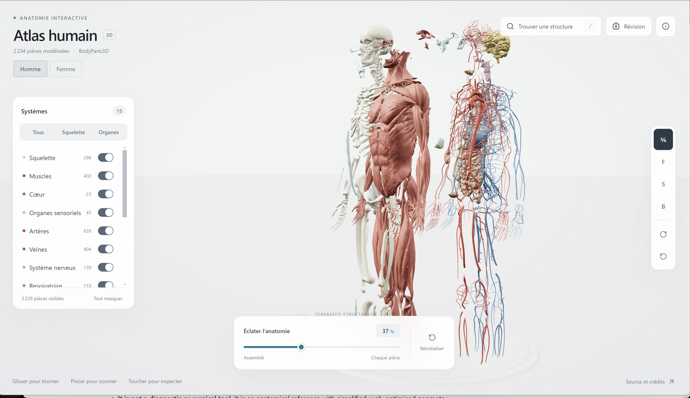
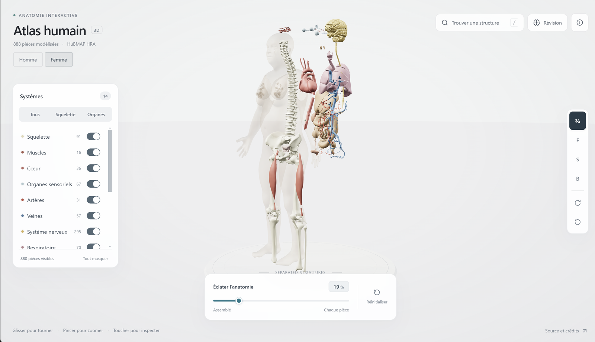
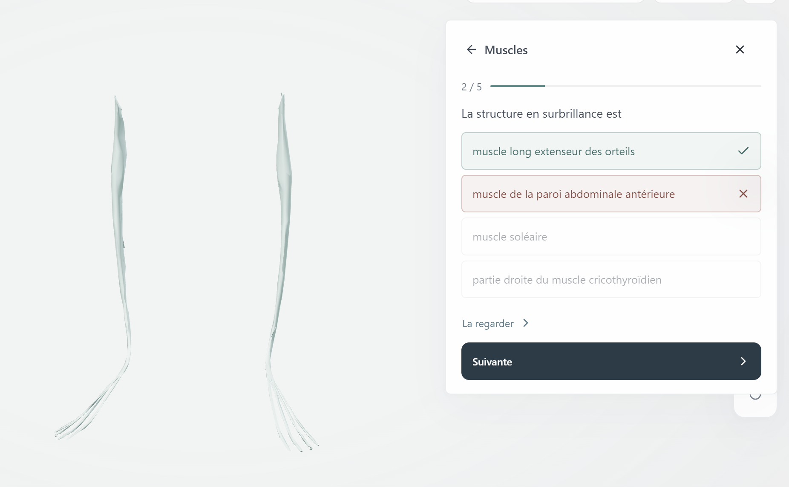
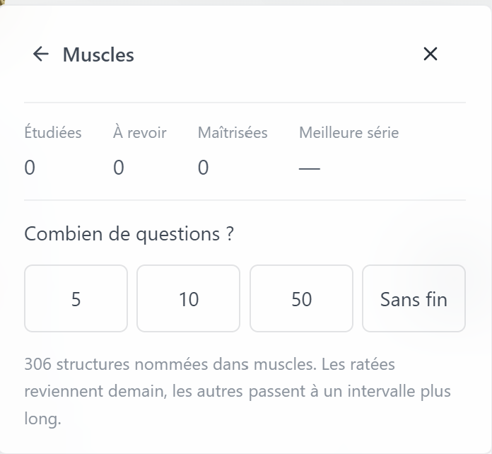
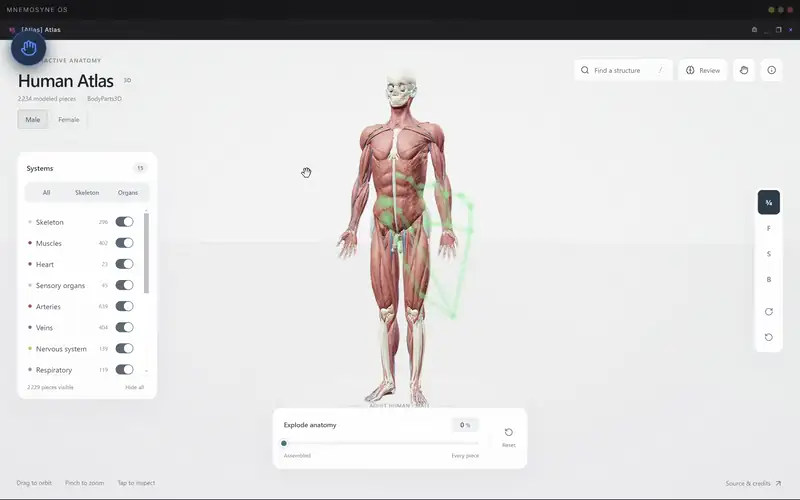

🌐 [**mnemosyne-os.io**](https://mnemosyne-os.io) — the product&ensp;·&ensp;[**mnemosyne-os.com**](https://mnemosyne-os.com) — for organizations&ensp;·&ensp;📖 [**docs.mnemosyne-os.io**](https://docs.mnemosyne-os.io) — the documentation

# Atlas

An interactive 3D atlas of the human body, running inside [Mnemosyne OS](https://mnemosyne-os.io) with no network connection at all.

Two bodies, 2,288 individually selectable meshes and 3,486 named anatomical structures. Toggle fifteen systems, pick a body region, isolate a single structure, or explode the whole body into its parts. Follow a guided visit through an organ. Then revise what you are looking at, and ask what your own notes already say about it.

## This is a port, and the viewer is not ours

The 3D viewer is **[Human Atlas](https://github.com/ashemag/human-atlas) by Ashe Magalhaes**, released under MIT. The scene, the geometry batching, the exploded layout, the search and the styling are all upstream's work. [`NOTICE.md`](./NOTICE.md) lists every change we made and why, the upstream bugs we fixed, and the upstream pull requests our features come from, with their authors.

The anatomy comes from three sources, and their attribution is a licence condition, not a courtesy:

> BodyParts3D, © The Database Center for Life Science licensed under [CC Attribution 4.0 International](https://creativecommons.org/licenses/by/4.0/).

> Kristen Browne; Heidi Schlehlein. 2023. *3D Reference Organ Set for Female, v1.5.* [CC BY 4.0](https://creativecommons.org/licenses/by/4.0/).

The 54 peripheral nerves of the male body come from a third source, under a share-alike licence:

> "Z-Anatomy" – [CC-BY-SA 4.0](https://creativecommons.org/licenses/by-sa/4.0/). https://www.z-anatomy.com

That licence covers `nerves-0.bin.gz` and the nerve entries in `atlas.json`. See [`NOTICE.md`](./NOTICE.md).

All three are shown in the app's *Source & credits* panel, whichever body is on screen, because the cartridge distributes all three. Do not remove them.

The two bodies are two different datasets, and the header says which one you are looking at. They are not comparable in depth: the male reference is a whole-body model at 2,288 meshes, the female one is an organ set at 888. What that costs is written out below.

## What the cartridge adds

**A memory panel.** Every structure carries an **FMA identifier**. `FMA14769` is `hepatic artery` whatever language you work in, however you spell it, whichever source it came from. That makes the body a spatial index into your own memory. Select a structure, press the button, and Mnemosyne OS answers from your own vaults: the lecture notes you wrote, the figures pulled out of your PDFs, the chronicle from the day you studied it.

It is a button and not an automatic lookup, on purpose. Asking memory a question costs a model call, and browsing a skeleton should not bill anyone.

If your memory holds nothing about that structure, the panel says so in those words. It does not say the feature is broken, and it does not invent an answer.

**Revision.** One level per organ system, derived from the atlas that is actually loaded, so the counts on the tiles are the counts that will be asked. Runs of 5, 10, 50 or endless, with a Leitner schedule filed against the FMA id rather than against a name. A run is written to the cartridge's own vault as a single chronicle, and only when you press save.

A question highlights one structure in the body and offers four different names from the same system, so a wrong answer is wrong for an anatomical reason and not because the other options were obviously absurd. *La regarder* moves the camera onto the structure instead of telling you the answer.

The four counters are the level's own state, and a streak nobody has set yet renders as a dash rather than as a zero. The line underneath says how many structures the level can actually ask about in the language you are working in.

**Body regions and study areas.** The systems panel offers six regions: head and neck, torso, abdomen, arm and hand, pelvis, legs. Each region frames itself on screen. Inside a region, study areas narrow the view further: the orbit, the circle of Willis, the brachial plexus, the cubital fossa, the porta hepatis, the popliteal fossa, and eleven more. A region filters the systems you have switched on. With only the skeleton on, « Legs » shows the bones of the legs.

**Guided visits.** The path icon at the top right opens the visits. Five follow an organ: the heart, breathing, digestion, the urinary tract and the reproductive tract. A visit walks through an organ stop by stop. Each stop is shown on its own, framed and explained, with Previous and Next in the detail panel. « Show surrounding anatomy » brings the rest of the organ back around it. The heart visit follows the blood through the four chambers and the four valves. The same visit adapts to the female body and skips the stops it lacks. A sixth visit follows the trigeminal nerve and its three branches, with the zone of the face each one serves. Four more follow fascial lines, after the model of muscle chains proposed by Thomas Myers, which anatomists still debate. A line lights its muscles station by station, then all at once, and names the links this atlas lacks.

**Hide one structure.** Select a structure and press « Hide this structure » to clear the view around what you are studying. The systems panel offers to bring hidden structures back.

**Dark or light, like the app.** The atlas follows the theme of Mnemosyne OS, the 3D stage included.

**Your hands drive the body** (Mnemosyne OS 1.7.0 or later, hand tracking on). Put the Atlas in full screen. Pinch and move to turn the body. Pinch and bring your hand toward the camera to come closer. Pinch with both hands and spread them to open the body by stages, and bring them together to put it back. Hold your open hands still to frame the body again, and pinch and hold on a point to open that structure. You can also teach a pose for « Exploded view » in My gestures: it takes the body all apart, or puts it all back. The hand icon at the top right lists these gestures, says whether Mnemosyne OS granted them, and sets three speeds: turn, zoom and open. The cartridge never sees the camera or your hand. It receives intentions such as « turn by 12 px ».

18 s, recorded in the app. Click for the MP4.

**Seven interface languages, and structure names in French and Spanish.** The names come from Wikidata and are **not reviewed by anatomists**. The app says so in a notice you dismiss once per language, names English as the reference, and tells you how many structures that language covers. The 54 nerves have names written by hand. A female structure borrows the name of the male structure that has exactly the same English name. A question never mixes two languages: the quiz only asks about structures that have a name in the language you are working in.

## Changes

**0.2.6**
- Your review progress comes back after you close the Atlas. It was saved, but read back from the wrong place.

**0.2.5**
- A review question always offers four different names. Some structures share a name, and the same answer could appear twice.
- Structures without a name are left out of the review.
- The language notice counts the structures the body on screen can ask about.
- Reset, a system, a region or a study area ends a guided visit. Ending a visit brings back the region it started from.
- Searching « pulmonary valve » finds the valve. A single broad word like « lung » still finds the bronchial and pulmonary pieces.
- A study area is offered only with 8 pieces or more.
- Error messages are translated, and loading has a time limit.

**0.2.4**
- A guided visit of the trigeminal nerve and four fascial lines.
- Tibialis anterior, tibialis posterior, the three fibularis muscles and tensor fasciae latae are now filed as muscles. They were filed as bone or connective tissue.

**0.2.3**
- Each stop of a guided visit is shown on its own. The aortic valve sits inside the heart and was hidden by its wall.
- The caption above the explode slider is translated.

**0.2.2**
- Body regions and study areas, guided visits, hiding one structure, and the app's dark or light theme.
- 54 peripheral nerves from Z-Anatomy, with French and Spanish names.
- 144 female structures in French and 123 in Spanish take the name of the male structure with the same English name.
- The wheel zooms toward the pointer, and the camera holds still while the body opens.
- The iliotibial tracts are filed as connective tissue, and the brain's ventricles as nervous system. They were filed as bone and as heart.
- « View anatomical source » links to the dataset each structure comes from.

## What it does not do

- **It is not a diagnostic or surgical tool.** It is an anatomical reference with simplified, web-optimised geometry.
- **It does not contain every human structure.** The male body has 54 peripheral nerves, the main trunks only. The female reference set is an organ set rather than a whole-body model: it has no arms, no hands, no feet, and 16 muscles of which 12 are eye muscles. The app's own credits panel says so.
- **It reads your memory, and it writes only its own.** The cartridge asks for `vault:read`, `vault:write` and `gesture:receive`. The write permission exists for one thing: saving a revision run into the cartridge's own sandbox vault, on your gesture. It never writes to your other vaults. A sandbox vault is a store the cartridge owns. Making anything in it permanent is a decision you make in the shell.

## Installing

Install it from MnemoHub like any other cartridge. Nothing is built, downloaded or compiled on your machine: the 3D geometry ships with the cartridge and is read straight off your disk.

## Licence

MIT, with the upstream copyright preserved. Anatomy data under CC BY 4.0, except the peripheral nerves (CC BY-SA 4.0). Structure names from Wikidata under CC0. See [`LICENSE`](./LICENSE) and [`NOTICE.md`](./NOTICE.md).

## Where Mnemosyne OS lives

This cartridge runs inside **Mnemosyne OS**, the sovereign, local-first memory operating system published by XPACEGEMS LLC. Its official addresses:

- Product site: <https://mnemosyne-os.io>
- Organizations: <https://mnemosyne-os.com>
- Documentation: <https://docs.mnemosyne-os.io>
- Host source: <https://github.com/Mnemosyne-OS/Mnemosyne-Neural-OS>
- Packages: the npm scope `@mnemosyne_os`

---

**[Mnemosyne OS](https://mnemosyne-os.io)** — the sovereign, local-first memory OS this cartridge runs in.
Get it at [mnemosyne-os.io/download](https://mnemosyne-os.io/download), install cartridges from the built-in MnemoHub store, or [build your own](https://mnemosyne-os.io/dev).
